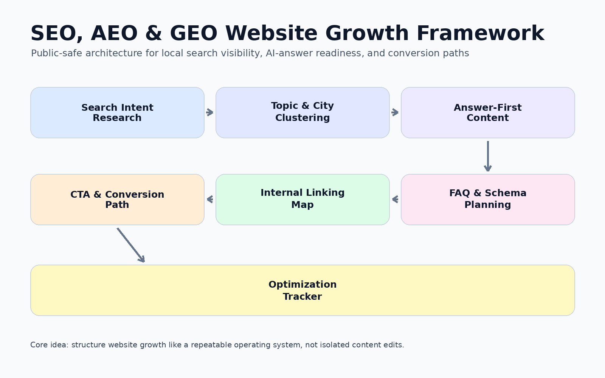
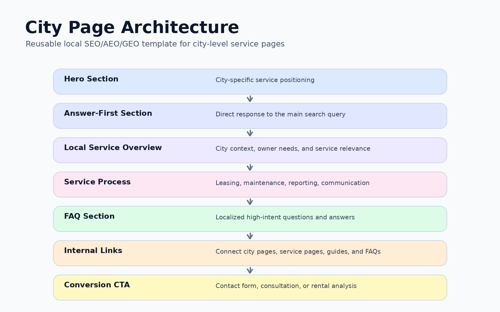
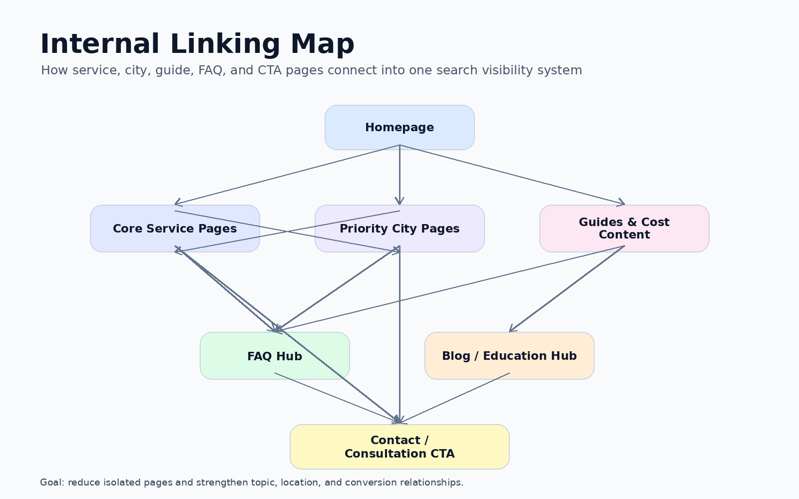

# 🔎 SEO, AEO & GEO Website Growth Framework


A public-safe marketing technology and growth operations project showing how a local service-business website can be structured for SEO, AEO, GEO, AI-answer visibility, city-page scalability, FAQ coverage, schema planning, internal linking, and conversion-focused owner lead generation.

This repository is a public-safe reconstruction. All examples are synthetic or generalized. No private company data, internal analytics exports, account IDs, unpublished strategy documents, client information, tenant information, owner information, or private screenshots are included.

---

## 👤 Recruiter Summary

This project demonstrates my ability to design a scalable search and AI-visibility framework for local lead generation.

I structured a website growth system that connects keyword intent, city-page architecture, answer-first content, FAQ planning, schema recommendations, internal linking, and conversion-focused calls to action.

The project is positioned as a marketing technology, SEO/AEO/GEO, and growth operations system, not just a content-writing example.

---

## 🧩 Portfolio Positioning

This project shows how search visibility work can be organized as a repeatable operating system.

It demonstrates:

* Local SEO strategy
* Answer Engine Optimization
* Generative Engine Optimization
* AI-search visibility planning
* City-page architecture
* FAQ structure
* Schema planning
* Internal linking strategy
* Conversion-focused CTA mapping
* Content inventory tracking
* Public-safe documentation

---

## 📊 Project Metrics Snapshot

The metrics below are synthetic portfolio metrics used to demonstrate the structure of the framework.

| Metric | Value |
| ----- | ----: |
| Synthetic city pages mapped | 10 |
| Mock service pages reviewed | 8 |
| Intent clusters created | 6 |
| FAQ groups planned | 12 |
| Schema examples documented | 5 |
| Internal linking paths mapped | 24 |
| CTA types documented | 4 |
| Mock optimization priorities assigned | 18 |

---

## ✨ Project Highlights

* Built a reusable SEO/AEO/GEO framework for local service-business visibility.
* Designed answer-first page structures for high-intent search queries.
* Created city-page templates for scalable local search coverage.
* Planned FAQ structures to support Google search and AI-generated answers.
* Mapped internal links between service pages, city pages, blog content, and consultation CTAs.
* Documented schema examples for local service-area visibility.
* Created mock content inventory files to show how page status and optimization priorities can be tracked.
* Kept the full repository public-safe using synthetic examples only.

---

## 📈 Business Impact

This project shows how a website can move from scattered content updates to a structured search visibility system.

The framework supports:

* Stronger local search organization
* Better AI-answer readability
* More consistent city-page creation
* Clearer owner-intent content paths
* Improved internal linking discipline
* Better conversion alignment across service pages
* More scalable content operations

The main value is not only writing pages. The value is building a repeatable framework for search visibility, AI-readiness, and lead-generation content architecture.

---

## 🎯 Project Objective

The objective of this project is to demonstrate how website growth work can be structured as a scalable marketing technology system.

```text
Search intent research
        ↓
Topic and city clustering
        ↓
Answer-first content structure
        ↓
FAQ and schema planning
        ↓
Internal linking map
        ↓
CTA and conversion path alignment
        ↓
Page optimization tracker
```

---

## 💼 Business Problem

Local service-business websites often have pages, blogs, and landing pages that are created one at a time without a clear content architecture.

Common issues include:

* City pages are inconsistent.
* FAQs are not structured for search or AI answers.
* Internal linking is weak.
* CTAs are not aligned with user intent.
* Schema is incomplete or inconsistent.
* Blog content does not clearly support service pages.
* Content priorities are hard to track.
* SEO work is not connected to conversion paths.

---

## 👩‍💻 My Role

I worked on structuring the website growth workflow into a scalable SEO/AEO/GEO framework.

My responsibilities included:

* Mapping local service-area page structures
* Organizing content around search intent
* Creating answer-first page frameworks
* Planning FAQ sections
* Supporting schema and structured-data recommendations
* Mapping internal links
* Aligning content sections with conversion-focused CTAs
* Documenting the workflow in a public-safe portfolio format

---

## 🏗️ Framework Architecture

📌 View the full visual workflow here: [`docs/project_architecture.md`](docs/project_architecture.md)

| Layer | Folder | Purpose |
| ---- | ------ | ------- |
| Research Layer | `datasets/mock/` | Synthetic content inventory and keyword-intent examples |
| Strategy Layer | `docs/` | Templates, schema examples, linking strategy, FAQ structure |
| Output Layer | `outputs/` | Mock optimization summaries and page priority reports |
| Visual Layer | `images/` | Recreated public-safe workflow diagrams |

---

## 🖼️ Visual Frameworks

### SEO, AEO & GEO Framework



### City Page Architecture



### Internal Linking Map



---

## 🔄 SEO/AEO/GEO Workflow

### 1. Search Intent Mapping

Group topics by audience intent, service need, city, and funnel stage.

### 2. City-Page Architecture

Create reusable page structures for local service-area pages.

### 3. Answer-First Content

Place direct answers near the top of each page so both users and AI systems can extract clear responses.

### 4. FAQ Structure

Build question-and-answer blocks around high-intent search questions.

### 5. Schema Planning

Document structured-data examples for local business, service areas, FAQs, and article-style content.

### 6. Internal Linking

Connect service pages, city pages, blogs, consultation pages, and lead-conversion pages.

### 7. CTA Alignment

Map each page type to a conversion action, such as consultation, rental analysis, service inquiry, or contact form.

---

## 📘 Case Study

This project includes a full public-safe case study explaining the business problem, strategy framework, page architecture, AI-visibility logic, and documentation structure.

📌 Read the case study here: [`docs/case_study.md`](docs/case_study.md)

---

## 📂 Repository Structure

```text
seo-aeo-geo-local-growth-framework/
│
├── datasets/
│   └── mock/
│       ├── content_inventory_mock.csv
│       ├── keyword_intent_map_mock.csv
│       └── city_page_status_mock.csv
│
├── docs/
│   ├── requirements.md
│   ├── content_architecture.md
│   ├── city_page_template.md
│   ├── faq_structure.md
│   ├── internal_linking_map.md
│   ├── schema_examples.md
│   ├── ai_visibility_framework.md
│   ├── project_architecture.md
│   └── case_study.md
│
├── images/
│   ├── seo-aeo-geo-framework.png
│   ├── city-page-architecture.png
│   └── internal-linking-map.png
│
├── outputs/
│   ├── mock_content_gap_summary.csv
│   └── mock_page_optimization_summary.csv
│
├── README.md
├── LICENSE
└── .gitignore
```

---

## 📁 Mock Data Files

This repository uses mock files to demonstrate how a content operations framework can be organized.

| File | Purpose |
| ---- | ------- |
| `datasets/mock/content_inventory_mock.csv` | Tracks mock pages, page types, status, and optimization priority |
| `datasets/mock/keyword_intent_map_mock.csv` | Maps synthetic keywords to user intent, funnel stage, and page type |
| `datasets/mock/city_page_status_mock.csv` | Tracks mock city-page build status, FAQ coverage, schema status, and CTA alignment |
| `outputs/mock_content_gap_summary.csv` | Summarizes mock content gaps and recommended next steps |
| `outputs/mock_page_optimization_summary.csv` | Summarizes mock page-level optimization priorities |

---

## 🛠️ Tools Represented

The original workflow involved a marketing technology and website growth stack. This public reconstruction represents the workflow using safe, generalized tools and concepts:

* WordPress-style page architecture
* Divi-style landing page planning
* Google Search Console-style content analysis
* GA4-style conversion alignment
* Google Sheets-style content inventory tracking
* SEO/AEO/GEO research workflow
* Schema and structured-data planning
* AI-assisted content strategy
* Internal linking and conversion-path documentation

---

## 🎯 How This Project Maps to Real Roles

| Target Role | How This Project Supports It |
| ---------- | ---------------------------- |
| Technology Marketing Analyst | Shows structured website growth, AI visibility, and conversion planning |
| Growth Marketing Analyst | Connects search visibility to lead-generation pathways |
| Marketing Operations Analyst | Turns content work into a repeatable operating system |
| SEO Analyst | Demonstrates local SEO, page architecture, internal linking, and schema planning |
| AI Marketing Operations Analyst | Shows GEO, AEO, and AI-answer visibility strategy |
| Content Strategy Analyst | Connects content planning with search intent and funnel stages |
| Digital Marketing Analyst | Links page structure, content strategy, and conversion-focused reporting |

---

## 🧠 Skills Demonstrated

| Skill Area | What This Project Demonstrates |
| --------- | ------------------------------ |
| SEO Strategy | Local search structure, service pages, city pages, and internal linking |
| AEO | Answer-first content blocks and FAQ-driven content structure |
| GEO | AI-readable content organization and entity-focused page planning |
| Content Operations | Page inventory, status tracking, templates, and repeatable documentation |
| Conversion Strategy | CTA mapping and intent-based page alignment |
| Information Architecture | Structured page hierarchy, topic grouping, and internal navigation logic |
| Documentation | Public-safe case study, workflow notes, templates, and diagrams |
| Data Governance | Synthetic examples only, no private company data exposed |

---

## 🧭 Example Framework Logic

This project treats website growth as a structured system instead of isolated page updates.

```text
Audience question
        ↓
Intent category
        ↓
Page type
        ↓
Answer-first section
        ↓
Supporting FAQ block
        ↓
Schema recommendation
        ↓
Internal link destination
        ↓
Conversion CTA
```

Example:

| Search Intent | Page Type | Content Structure | CTA Type |
| ------------- | --------- | ----------------- | -------- |
| Compare providers | Service page | Direct answer, proof points, FAQs | Schedule consultation |
| Understand pricing | Blog or guide | Cost explanation, FAQ, internal links | Request analysis |
| Search by city | City page | Local service overview, FAQs, schema | Contact form |
| Validate expertise | Case study or service page | Process, proof, trust sections | Consultation CTA |

---

## 🔒 Confidentiality Notice

This repository is a public-safe reconstruction of a real website growth and search visibility workflow.

It does not include:

* Private company strategy documents
* Internal analytics exports
* Real Google Search Console data
* Real GA4 data
* Client, tenant, owner, or lead information
* Private URLs
* Account IDs
* Internal screenshots
* Unpublished company files
* Confidential business data

All examples, files, mock datasets, diagrams, and outputs are synthetic or generalized for portfolio demonstration.

---

## 🚧 Status

This repository is a completed public-safe portfolio reconstruction of an SEO, AEO, and GEO website growth framework.

Completed build phases:

1. Created public-safe project structure
2. Added synthetic content inventory examples
3. Built city-page template documentation
4. Added FAQ and schema planning examples
5. Documented internal linking logic
6. Created AI-visibility framework
7. Added public-safe case study
8. Finalized portfolio-facing documentation
9. Added public-safe visual framework diagrams

---

## 🌱 About This Project

This project is designed to show how search visibility work can be structured like a technical growth system.

The goal is to demonstrate that SEO work is not only content writing. It can include information architecture, AI-answer readiness, structured data, internal linking, conversion paths, and repeatable content operations.
