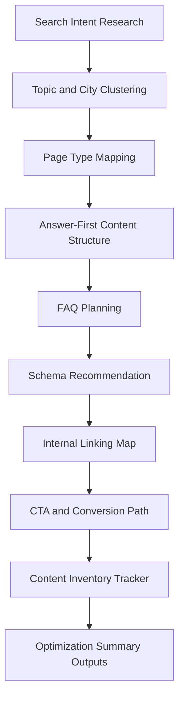
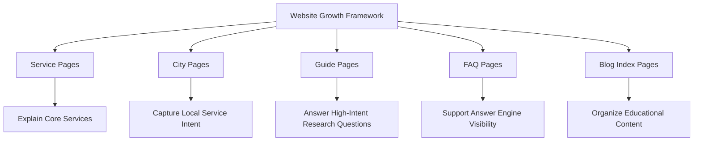
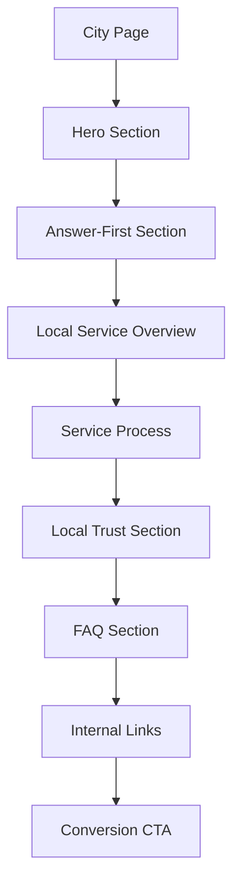
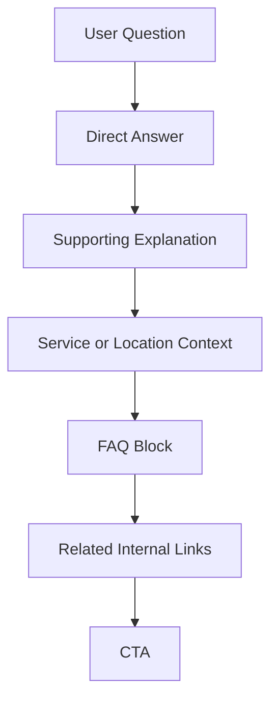
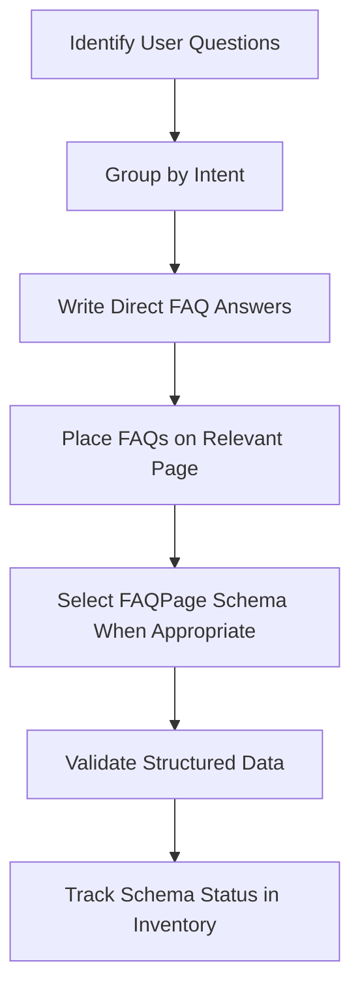
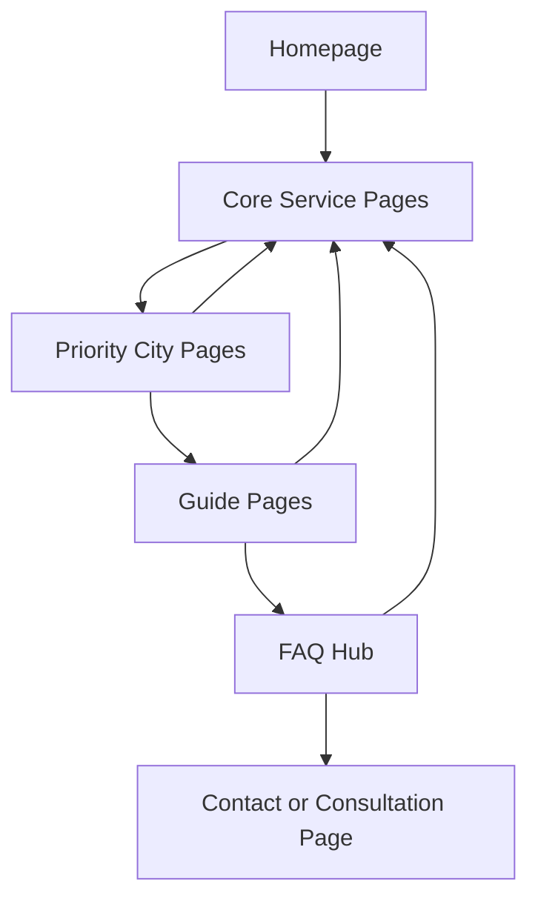
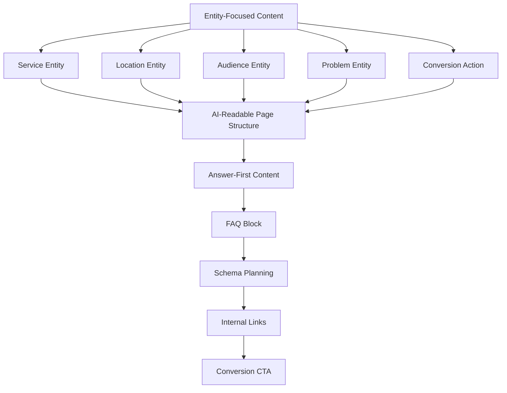
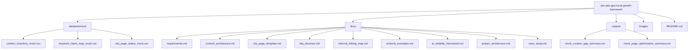
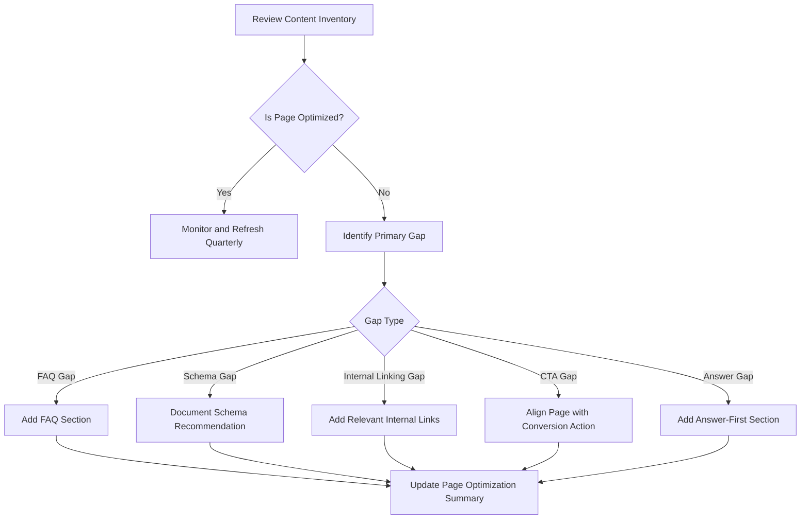

# Project Architecture

## Purpose

This document provides the visual architecture for the SEO, AEO, and GEO Website Growth Framework.

The project shows how search-intent research, city-page planning, answer-first content, FAQ structure, schema planning, internal linking, and conversion paths can be organized into a repeatable website growth system.

---

## 1. End-to-End SEO/AEO/GEO Framework

---

## 2. Content Operations Architecture

---

## 3. Page Type Strategy

---

## 4. City Page Architecture

---

## 5. Answer-First Content Model

---

## 6. FAQ and Schema Workflow

---

## 7. Internal Linking Architecture

---

## 8. AI Visibility Architecture

---

## 9. Repository Architecture

---

## 10. Optimization Priority Workflow

---

## 11. Strategic Layers

| Layer | Purpose | Example File |
| ---- | ------- | ------------ |
| Research Layer | Organizes keywords, intent, and page mapping | `datasets/mock/keyword_intent_map_mock.csv` |
| Content Inventory Layer | Tracks page type, status, priority, and AI visibility goals | `datasets/mock/content_inventory_mock.csv` |
| City Page Layer | Tracks city-page status, FAQ coverage, schema status, and CTA alignment | `datasets/mock/city_page_status_mock.csv` |
| Documentation Layer | Explains templates, linking logic, schema, and AI visibility | `docs/` |
| Output Layer | Summarizes content gaps and optimization priorities | `outputs/` |
| Portfolio Layer | Presents the project for recruiters and hiring managers | `README.md` |

---

## 12. Business Logic Summary

This project uses a structured workflow:

1. Identify user search intent.
2. Map intent to page type.
3. Organize pages by city, service, and funnel stage.
4. Add answer-first sections.
5. Add FAQ blocks.
6. Document schema recommendations.
7. Add internal links.
8. Align each page with a conversion CTA.
9. Track optimization status.
10. Summarize gaps and priorities.

---

## Public-Safe Note

These diagrams are public-safe visual reconstructions. They do not include private company strategy documents, real analytics exports, internal URLs, account IDs, client information, tenant information, owner information, or confidential business data.
